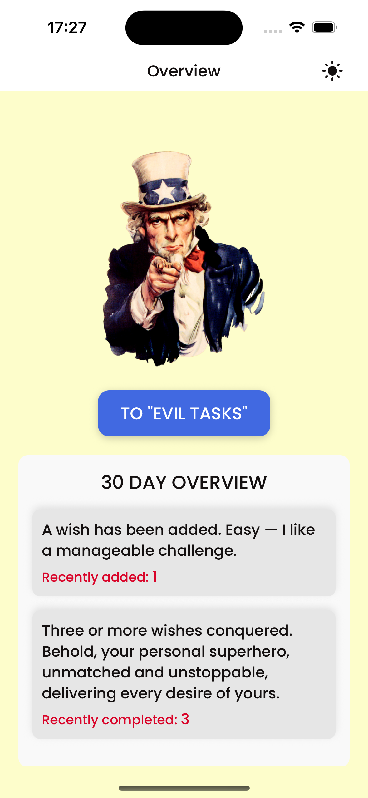
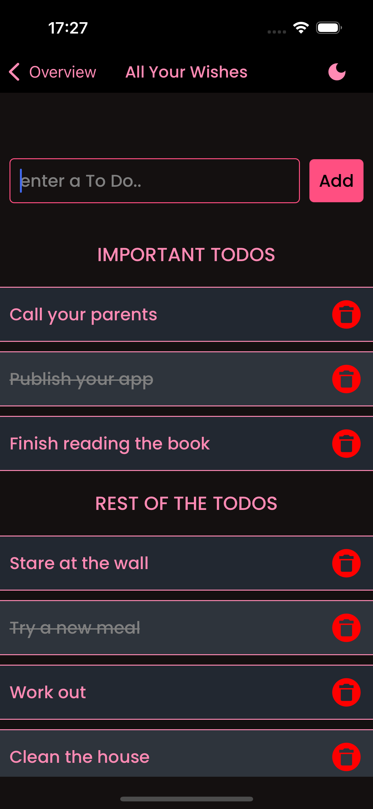
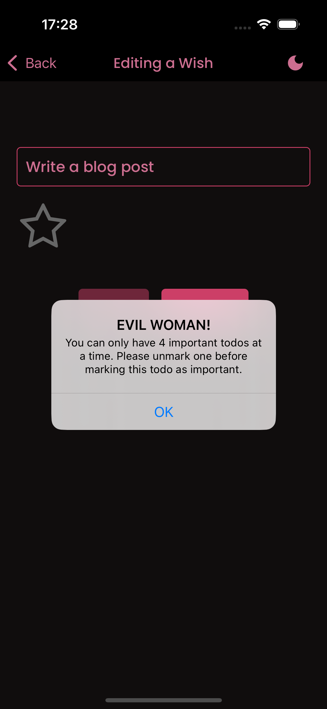

# React Native Expo - Romantic ToDo App 👋

A simple and efficient ToDo app built for my girlfriend which will help her manage her wishes from me effortlessly. ✨

This app offers a clean user interface with features like task listing, adding, editing, and deleting tasks.

## Features

- **Cross platform mobile app**: supports both ios and android
- **Add, Edit, and Delete Tasks**: Easily add, edit, or delete tasks based on your needs.
- **Light and Dark modes**: Easily switch between the light or the pink themed dark mode.
- **Local Storage**: Store your task list persistently, ensuring that your tasks remain available even if the app is closed and reopened.
- **Overview Page**: See the overview of last 30 days, with funny quotes.
- **Priority Tasks**: Ability to mark some tasks as important, while providing a hard limit for that.

## Screenshots

<!--  -->

<div style="display: flex; gap: 10px;">

  
  
  

</div>

## Get started

### Prerequisites 🛠️

- [Node.js](https://nodejs.org/) installed on your machine

### Installation 📦

1. **Clone the repository:**

   ```bash
   git clone https://github.com/berkgirgin/basic_RN_ToDo_App.git
   ```

2. **Change into the project directory:**

   ```bash
   cd basic_RN_ToDo_App
   ```

3. **Install dependencies:**

   ```bash
   npm install
   ```

### Running the App(in Expo) ▶️

```bash
npm start
```

In the output, you'll find options to open the app in a

- Press a │ open Android
- Press i │ open iOS simulator
- Press w │ open web
